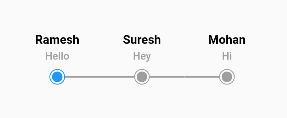
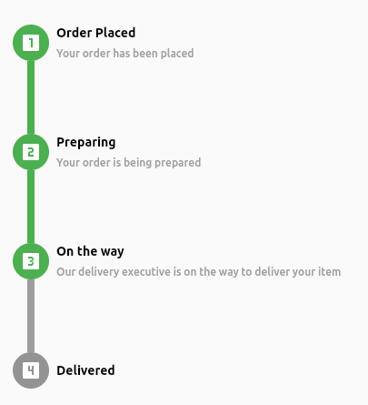
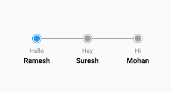
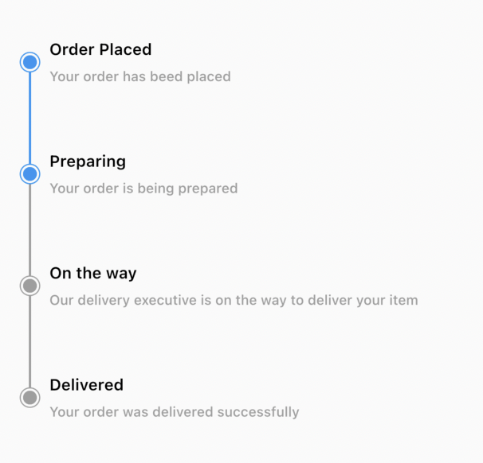
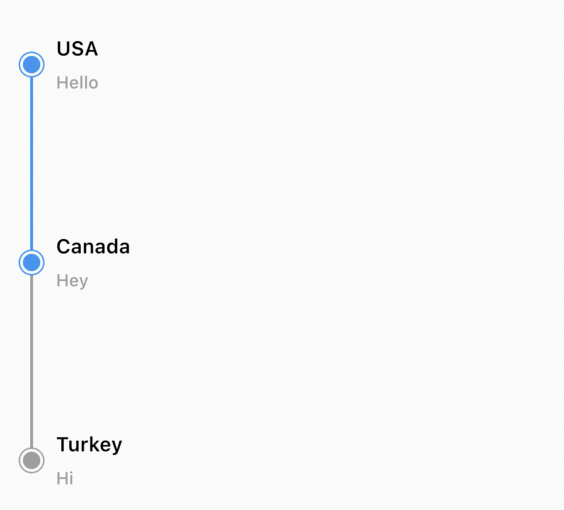
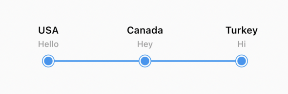
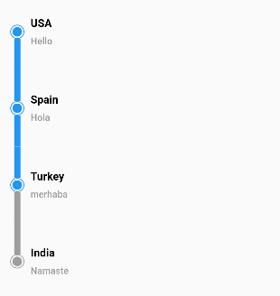
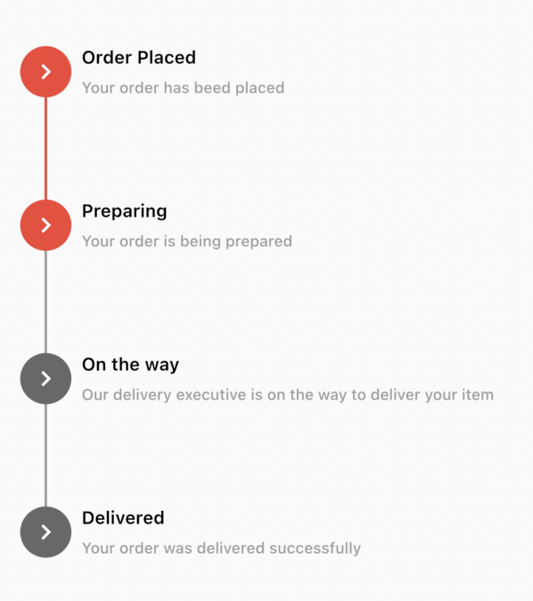
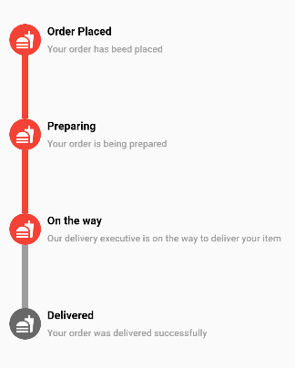

A flutter package to create easily customizable Horizontal and Vertical stepper.

## Getting started
In the `dependencies`: section of your `pubspec.yaml`, add the following line:
```yaml
dependencies:
  another_stepper: <latest_version>
```

Import the following in your working dart file: 
```dart
import 'package:another_stepper/another_stepper.dart';
```

## Example AnotherStepper

#### Dummy StepperData

```dart
  List<StepperData> stepperData = [
  StepperData(
      title: StepperText(
        "Order Placed",
        textStyle: const TextStyle(
          color: Colors.grey,
        ),
      ),
      subtitle: StepperText("Your order has been placed"),
      iconWidget: Container(
        padding: const EdgeInsets.all(8),
        decoration: const BoxDecoration(
            color: Colors.green,
            borderRadius: BorderRadius.all(Radius.circular(30))),
        child: const Icon(Icons.looks_one, color: Colors.white),
      )),
  StepperData(
      title: StepperText("Preparing"),
      subtitle: StepperText("Your order is being prepared"),
      iconWidget: Container(
        padding: const EdgeInsets.all(8),
        decoration: const BoxDecoration(
            color: Colors.green,
            borderRadius: BorderRadius.all(Radius.circular(30))),
        child: const Icon(Icons.looks_two, color: Colors.white),
      )),
  StepperData(
      title: StepperText("On the way"),
      subtitle: StepperText(
          "Our delivery executive is on the way to deliver your item"),
      iconWidget: Container(
        padding: const EdgeInsets.all(8),
        decoration: const BoxDecoration(
            color: Colors.green,
            borderRadius: BorderRadius.all(Radius.circular(30))),
        child: const Icon(Icons.looks_3, color: Colors.white),
      )),
  StepperData(
    title: StepperText("Delivered",
        textStyle: const TextStyle(
          color: Colors.grey,
        )),
  ),
];
```

#### Dummy StepperText

```dart
StepperText("Delivered",
        textStyle: const TextStyle(
          color: Colors.grey)),
```

#### Horizontal(Default)
```dart
AnotherStepper(
  stepperList: stepperData,
  stepperDirection: Axis.horizontal,
  iconWidth: 40, // Height that will be applied to all the stepper icons
  iconHeight: 40, // Width that will be applied to all the stepper icons
)
```

#### Output Horizontal(Default)


<br>

#### Vertical(Default)
```dart
AnotherStepper(
  stepperList: stepperData,
  stepperDirection: Axis.vertical,
  iconWidth: 40, // Height that will be applied to all the stepper icons
  iconHeight: 40, // Width that will be applied to all the stepper icons
)
```

#### Output Vertical(Default)


<br>

#### Horizontal Inverted
```dart
AnotherStepper(
  stepperList: stepperData,
  stepperDirection: Axis.horizontal,
  inverted: true,
)
```

#### Output Horizontal Inverted


<br>

#### Vertical Inverted
```dart
AnotherStepper(
  stepperList: stepperData,
  stepperDirection: Axis.vertical,
  inverted: true,
)
```

#### Output Vertical Inverted


<br>

#### Active index
```dart
AnotherStepper(
  stepperList: stepperData,
  stepperDirection: Axis.vertical,
  inverted: false,
  activeIndex: 2,
)
```

#### Output Active index


<br>

#### Vertical Gap
```dart
AnotherStepper(
  stepperList: stepperData,
  stepperDirection: Axis.vertical,
  inverted: false,
  activeIndex: 2,
  gap: 60,
)
```

#### Output Vertical Gap


<br>

#### Horizontal Gap
```dart
AnotherStepper(
  stepperList: stepperData,
  stepperDirection: Axis.horizontal,
  inverted: false,
  activeIndex: 2,
  gap: 60,
)
```

#### Output Horizontal Gap


<br>

#### Bar Thickness
```dart
AnotherStepper(
  stepperList: stepperData,
  stepperDirection: Axis.vertical,
  inverted: false,
  activeIndex: 2,
  barThickness: 8,
)
```

#### Output Bar Thickness



<br>

#### Custom Dot and Bar
```dart
AnotherStepper(
  stepperList: stepperData,
  stepperDirection: Axis.vertical,
  dotWidget: Container(
  padding: EdgeInsets.all(8),
  decoration: BoxDecoration(
  color: Colors.red,
  borderRadius: BorderRadius.all(Radius.circular(30))
  ),
  child: Icon(Icons.navigate_next_sharp, color: Colors.white),
  ),
  activeBarColor: Colors.red,
  inActiveBarColor: Colors.grey,
  activeIndex: 1,
)
```

#### Output Custom Dot and Bar


<br>

#### Custom Dot, Bar, Dot thickness and long text
```dart
AnotherStepper(
  stepperList: stepperData,
  stepperDirection: Axis.vertical,
  dotWidget: Container(
  padding: EdgeInsets.all(8),
  decoration: BoxDecoration(
  color: Colors.red,
  borderRadius: BorderRadius.all(Radius.circular(30))
  ),
  child: Icon(Icons.fastfood, color: Colors.white),
  ),
  activeBarColor: Colors.red,
  inActiveBarColor: Colors.grey,
  activeIndex: 2,
  barThickness: 8,
)
```

#### Output Dot, Bar, Dot thickness and long text

